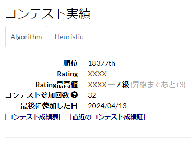

# AtCoder-HiderRatingAndPerformance

AtCoderのレーティングやパフォーマンスを非表示にするスクリプト

 
 

## 用途
色変を目指して、Rate参加したいけど、パフォーマンスの変動に一喜一憂し過ぎて、モチベーションが下がるのを防ぐのにお使い下さい。    

## 挙動
* AtCoderユーザーページのレーティンググラフが非表示になります
* AtCoderユーザーページの「Rating」、「Rating最高値」が「XXXX」に置き換わります
* Ratingの色は表示されます
* AtCoderユーザーページのhistoryのパフォーマンス以下右側の列が消去されます
* AtCoderユーザーページのhistoryの順位の列が消去されます
* AtCoderユーザーページの「順位」が非表示になります
* コンテストの順位表のタブが非表示になります

スクリプトの最初にある`config_hide_ranking`を書き換えることで、順位まで非表示にするかどうか、切り替えることができます。(デフォルト設定は無効)

## ⬇️ インストール
[greasyfork](https://greasyfork.org/ja/scripts/492653-atcoder-hiderratingandperformance)のページからインストールしてください。    
Tampermonkeyなどのユーザースクリプト実行アドオンが別途必要です。    

## 🔨 使い方
特になし。     
無効にしたい場合、Tampermonkeyなどから無効化を行ってください。    

## 🎫 LICENSE

[MIT](./LICENSE)

## ✍ Author

[PenguinCabinet](https://github.com/PenguinCabinet)
